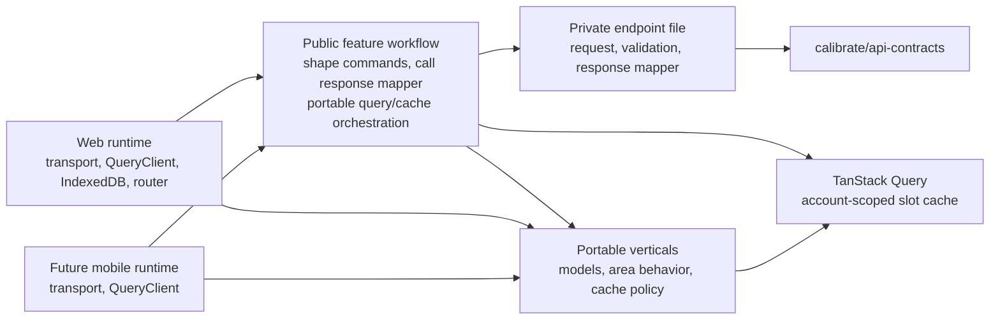

# Frontend core refactor plan

## Current pressure points

The renamed `@calibrate/frontend-core` package has the useful portable transport seam, but its temporary public operation leaves still return API-contract types. The requested web areas each then couple directly to contract response shapes:

- Logs renders `DayLogResponse` and `FoodEntryResponse`, while its save workflow writes API-shaped data into the cache.
- Dashboard V2 reads cache slots but keeps an obsolete `DayLogRangeResponse` type alias; its legacy nutrition model has no production import.
- The Day Log cache persists raw Day Log responses and separately reconstructs version/freshness semantics from TanStack Query state.

The package identity and direct-import surface are present on this branch. The remaining work moves one complete user-goal boundary at a time. It must not change the server sync protocol or the browser cache fence.

## Architecture

## Stages

### 1. Establish `@calibrate/frontend-core` without behavior change

Rename the package, project references, lockfile workspace name, and every consuming import. Replace the current root imports with direct leaf imports and an explicit package export map. Use temporary leaf adapters where necessary so this checkpoint remains mechanical; do not retain a compatibility `@calibrate/api-client` package or alter endpoint behavior.

Verify `@calibrate/frontend-core` and web typecheck/test targets before beginning model changes.

### 2. Complete Day Log workflows as vertical slices

Tickets 02 and 03 are superseded as implementation checkpoints. Each workflow ticket now delivers the frontend-domain model and builder it needs, private endpoint request and co-located pure response mapper, public workflow, caller migration, and focused tests together. The request operation returns the validated API response without calling the mapper. The workflow calls the mapper before returning or caching domain data. A private endpoint has no React Query import, cache writes, or fallback policy.

Ticket 04 establishes the shared Day Log/Meal/Food Entry and `DayLogSnapshot` models while moving sync request, mapper, workflow, account-scoped cache mechanics, and portable persistence policy together. Tickets 05 and 06 independently complete Save Food Entry and Update Weight, each with its acknowledgement model, endpoint, mapper, mutation workflow, and result-specific cache reconciliation. Ticket 07 completes the single-date/range Day Log read goal and migrates Logs. Ticket 08 completes Food Search and cache-only recents. A read goal may use two endpoints; the endpoint file remains the response-shape boundary for each.

Keep `package.json` exports as a narrow allowlist. Each slice adds only its public workflow/model/`__mocks__` leaves; `src/api/**` stays an internal filesystem path. The final ticket audits the completed export map. Configurable `ApiTransport.credentials` belongs with the session slice in ticket 10 and retains the `"include"` default, so earlier Day Log slices continue to use current web behavior.

The public `src/feature-workflows/<workflow-group>/<goal>.ts` modules own TanStack Query options/hooks and application-layer orchestration. A workflow receives host-supplied account context, maps frontend commands to API requests, calls one or more private operations and their co-located response mappers, applies result-specific cache updates, reconciles when needed, and defines fallback behavior. It can use shared keys and cache observations from portable verticals. Public successful outputs are frontend-domain models.

### 3. Migrate projections and authentication by goal

Ticket 09 moves the Dashboard V2 projection after the Day Log read boundary exists. It consumes domain snapshots and does not introduce another endpoint mapper. Tickets 10–14 independently complete session, Account Email Verification, Passkey Authentication, Passkey Registration, and local-development enrollment. Each auth ticket brings its needed model/builders, endpoint requests and co-located mappers, public workflow, web adapter handoff, and focused tests. Session ticket 10 introduces `AuthenticatedUserContext` and configurable transport credentials. Browser cache fencing, WebAuthn, and navigation remain in web.

Day Log cache mechanics live in `src/verticals/day-log-cache/`: query keys, slot observations, freshness decisions, cache buster, retention, account-scoped dehydration allowlist, persisted-snapshot validation, and pruning. Result-specific writes stay with their workflows: `applyDayLogSyncResult` in 04, `applyFoodEntryCreateToDayLogCache` in 05, and `applyWeightObservationToDayLogCache` in 06. Web composes core policy with its IndexedDB persister through `PersistQueryClientProvider` and retains its lifecycle fence.

Organize `src/verticals/<area>/` as portable feature folders. Pure calculations, frontend-domain and presentation models, and stateful QueryClient operations can all belong there when web and mobile share the behavior. Split `apps/web-frontend/src/verticals/day-log-cache/day-log-cache.ts` by ownership, and keep platform persisters and lifecycle code in their apps.

### 4. Stabilize and remove transitional seams

Ticket 15 removes temporary package-rename adapters once all consumers use final workflows/models. It checks approved exports, private endpoint ownership, mapper calls, and the application contract firewall. Convert shareable fixtures to co-located `__mocks__` builders; retain app-only fixtures in web. Run package and web suites and manually exercise Logs write/reconciliation plus Dashboard cache-first flow.

## Dependency order

1. **01:** package rename and initial direct-import allowlist (the renamed package is present on this branch; verify the ticket checkpoint before proceeding).
2. **04:** Day Log/sync/cache foundation.
3. **05 and 06:** Save Food Entry and Update Weight independently after 04.
4. **07:** Day Log reads and Logs after 04–06; **08:** Food Search after 04–05.
5. **09:** Dashboard projection after 07.
6. **10:** session/context/transport after 01; **11–14:** other auth goals independently after 10.
7. **15:** cleanup and full verification after all slices and Dashboard.

Tickets 02 and 03 remain as supersession records so existing references explain where their work went. The numbering gives a readable route through the work; the blocker lines permit independent auth and food work to proceed when their prerequisites are ready.

## Risks and mitigations

| Risk | Mitigation |
| --- | --- |
| A mapper accidentally becomes another public contract leak | Keep `api/**` package paths unexported, define response mappers in their private endpoint files, test workflow output types, and search app source for contract response imports. |
| Mutation options and hooks implement different save behavior | Put the user-goal policy behind one workflow interface and test both entry points against cache patching, conditional sync, and fallback cases. |
| A mechanical rename breaks TypeScript/Nx workspace resolution | Make it the first isolated checkpoint; update package, project references, paths, and lockfile together. |
| Moving cache logic changes Known-empty or unverified behavior | Characterize current query-key, timestamp, predecessor-version, sync-204, and fallback behavior before moving it. |
| Browser cache fence moves into core | Keep the IndexedDB persister, BroadcastChannel, document/window, and web provider lifecycle code in web; test this boundary by imports. |
| Portable persistence rules remain web-only or move with the browser persister | Put retention, allowlisting, validation, and pruning in core; each app composes those rules with its own persister in `PersistQueryClientProvider`. |
| A mixed web helper moves into core wholesale | Keep shared portable behavior in cohesive verticals and result-specific cache writes in their workflows; leave `indexed-db-day-log-cache.ts` and `browser-passkey-registration-adapter.ts` in web. |
| Future mobile auth does not use browser cookies | Make credentials configurable now; defer token/session storage and platform auth adapters. |
| Direct leaf paths expose implementation files | Use an explicit package export allowlist, not a wildcard export. |

## Verification checkpoints

These checkpoints are scheduled moments to run additional tests, checks, and manual verification after the verification in each defined task in the Phase 3 Task Breakdown. They are not intended to define commit boundaries. Commit according to the incremental implementation rule: each commit should capture one logical change, even if that means committing before, between, or after these verification checkpoints.

- After package rename: `npx nx run @calibrate/frontend-core:typecheck`, `npx nx run @calibrate/frontend-core:test`, and `npx nx run web:typecheck`.
- After 04: focused Day Log model, sync endpoint/mapper/workflow, and cache tests, plus targeted web cache integration tests.
- After 05–08: focused request/mapper/workflow tests for each goal, then `npx nx run web:test` and `npx nx run web:typecheck`.
- After 09: targeted Dashboard tests, `npx nx run web:test`, `npx nx run web:typecheck`.
- After each of 10–14: its focused auth endpoint/mapper/workflow and web handoff tests.
- Before merge: package tests/typecheck, web fast and integration suites, web lint, and format check.

## Task breakdown

See the ordered, independently reviewable tickets in [issues](./issues/). Tickets 02–03 are superseded; each ticket from 04 onward lists its goal, acceptance criteria, focused verification, and bounded file ownership.
