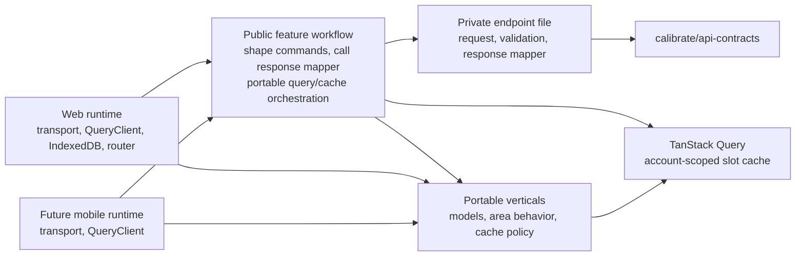

# Frontend core refactor plan

## Current pressure points

`@calibrate/api-client` already has the useful portable transport seam, but its public operations return API-contract types. The requested web areas each then couple directly to contract response shapes:

- Logs renders `DayLogResponse` and `FoodEntryResponse`, while its save workflow writes API-shaped data into the cache.
- Dashboard V2 reads cache slots but keeps an obsolete `DayLogRangeResponse` type alias; its legacy nutrition model has no production import.
- The Day Log cache persists raw Day Log responses and separately reconstructs version/freshness semantics from TanStack Query state.

The refactor must first establish the package identity and direct-import surface, then move one data boundary at a time. It must not change the server sync protocol or the browser cache fence.

## Architecture

## Stages

### 1. Establish `@calibrate/frontend-core` without behavior change

Rename the package, project references, lockfile workspace name, and every consuming import. Replace the current root imports with direct leaf imports and an explicit package export map. Use temporary leaf adapters where necessary so this checkpoint remains mechanical; do not retain a compatibility `@calibrate/api-client` package or alter endpoint behavior.

Verify `@calibrate/frontend-core` and web typecheck/test targets before beginning model changes.

### 2. Seal the API boundary and define the public module topology

Create the private `api/<area>/<endpoint>.ts` modules and move network-request details there: route/path/query, HTTP method, request-body validation, transport execution, and response validation. Define its pure validated-response-to-frontend-domain mapper in the same file. For example, `src/api/day-logs/save-food-entry.ts` owns `saveFoodEntry(transport, date, input)`, which returns the validated API response, and a separate pure mapper for that response. The request operation does not call the mapper. The file has no React Query import, cache writes, or fallback policy. Changes to network protocol details, transport or validation technology, or the endpoint's response shape belong here; a change to the Save Food Entry goal does not.

Make `package.json` exports a narrow allowlist for public vertical, workflow, transport/error, and test leaf paths. `src/api/**` is a private filesystem path, not an importable `@calibrate/frontend-core/api/**` package subpath. Add configurable `credentials` to `ApiTransport`, defaulting to `"include"`.

The public `src/feature-workflows/<workflow-group>/<goal>.ts` modules own TanStack Query options/hooks and application-layer orchestration. A workflow receives or resolves host-supplied account context, maps frontend command inputs to API request shapes, calls one or more private API operations, explicitly calls their co-located response mappers, applies result-specific cache updates, reconciles when needed, and defines fallback behavior. It can use shared keys and cache observations from portable verticals. Name each leaf for the cohesive user goal; choose a discoverable group without requiring it to match a vertical or endpoint. A workflow may depend on multiple verticals. Public successful outputs are frontend-domain models. Internal workflows and tests can import private endpoint functions; app code cannot import their package paths.

For the Save Food Entry migration, move `getSaveFoodEntryMutationOptions` and `useSaveFoodEntry` from the old combined API-client file to `src/feature-workflows/day-logs/save-food-entry.ts`. Fold the portable user-goal orchestration of `apps/web-frontend/src/verticals/day-log-cache/use-save-food-entry.ts` into that workflow: obtain injected account context and the app-owned `QueryClient`, execute the save command, call the response mapper defined in `src/api/day-logs/save-food-entry.ts`, apply the mapped acknowledgement to the account-scoped Day Log slot within the workflow using shared cache keys/models, conditionally sync one date, and retain the locally acknowledged entry for later validation if sync fails. Keep the web hook only as a thin adapter for web's account/transport setup if one remains useful.

### 3. Migrate Day Log and food data first

Create Day Log, Food Entry, Meal, food-search, and Day Log sync/write-acknowledgement models under `verticals/day-logs/models`. Keep `DayLog` meal nullability unchanged. Define `DayLogSnapshot` as `{ date, data: DayLog | null | undefined }` and use its `null`/`undefined` meanings consistently.

Implement Day Log and food response mappers in their private endpoint files, not in `verticals/<area>/models` or separate workflow mapper files. Workflows call those mappers before using frontend-domain data. Move reusable Day Log cache behavior into `src/verticals/day-log-cache/`: query keys, shared QueryClient slot observations, freshness decisions, and persistence policy (cache buster, retention, account-scoped dehydration allowlist, persisted-snapshot validation, and pruning). Put `applyDayLogSyncResult` in `feature-workflows/day-logs/sync-day-logs.ts`, `applyFoodEntryCreateToDayLogCache` in `feature-workflows/day-logs/save-food-entry.ts`, and `applyWeightObservationToDayLogCache` in `feature-workflows/day-logs/update-day-log-weight.ts`; each applies a result specific to its goal and uses shared cache keys/models. Web retains the IndexedDB persister and lifecycle fence, composing them with core policy through `PersistQueryClientProvider`; mobile can compose the same policy with its own persister.

Organize `src/verticals/<area>/` as portable feature folders, each responsible for one cohesive area. Pure calculations, frontend-domain and presentation models, and stateful QueryClient operations can all belong there when web and mobile share the behavior. Split `apps/web-frontend/src/verticals/day-log-cache/day-log-cache.ts` by ownership: shared cache mechanics in the Day Log cache vertical, result-application operations in their feature workflows. Workflows call endpoint mappers before passing frontend-domain values to verticals. Keep platform persisters and lifecycle code in their apps.

### 4. Migrate Logs and Dashboard consumers

Logs receives domain models and workflows through direct core imports. Move portable nutrition totals, meal definitions, cache-only recent-food ranking, and Dashboard V2 analytics projections into the appropriate `src/verticals/<area>/` folders. `rank-recent-foods-from-cache.ts` and `confirm-food-nutrition.ts` are candidate sources; extract behavior that can use frontend-domain inputs without page state or API-contract dependencies. Apply the same portability review to `log-page-helpers.ts`: keep web-specific route and presentation choices in web, while sharing behavior when both apps need the same semantics. Audit `dashboard-nutrition-model`; delete it and its test when the production-import audit remains empty.

### 5. Migrate authentication and complete the contract firewall

Create `AuthenticatedUserContext` plus auth response mappers in the respective private endpoint files. Auth workflows call those mappers. The web session-restoration gate continues to own browser cache confirmation/revocation, IndexedDB lifecycle handling, and navigation. Migrate all current passkey/email/session operation callers to direct public core leaf paths. Verify no app-facing operation returns a contract type and no requested web scope imports a response type from `@calibrate/api-contracts`.

### 6. Stabilize and remove transitional seams

Delete temporary package-rename adapters once consumers use final workflows/models. Convert shareable fixtures to co-located `__mocks__` builders; retain app-only fixtures in web. Run package and web suites, check direct import/export boundaries, and manually exercise the Logs write/reconciliation plus Dashboard cache-first flow.

## Dependency order

1. Package rename and direct import map
2. Private API/export allowlist and transport configuration
3. Day Log domain types and mappers
4. Sync/cache workflow
5. Save/weight reconciliation workflow
6. Logs and Dashboard migration
7. Auth migration
8. Cleanup and full verification

Tasks 4 and 5 share Day Log model work but can proceed after task 3. Logs and Dashboard can then migrate independently. Authentication is independent of Day Log behavior after the package rename, but finishes after the public export boundary is in place.

## Risks and mitigations

| Risk | Mitigation |
| --- | --- |
| A mapper accidentally becomes another public contract leak | Keep `api/**` package paths unexported, define response mappers in their private endpoint files, test workflow output types, and search app source for contract response imports. |
| Mutation options and hooks implement different save behavior | Put the user-goal policy behind one workflow interface and test both entry points against cache patching, conditional sync, and fallback cases. |
| A mechanical rename breaks TypeScript/Nx workspace resolution | Make it the first isolated checkpoint; update package, project references, paths, and lockfile together. |
| Moving cache logic changes Known-empty or unverified behavior | Characterize current query-key, timestamp, predecessor-version, sync-204, and fallback behavior before moving it. |
| Browser cache fence moves into core | Keep the IndexedDB persister, BroadcastChannel, document/window, and web provider lifecycle code in web; test this boundary by imports. |
| Portable persistence rules remain web-only or move with the browser persister | Put retention, allowlisting, validation, and pruning in core; each app composes those rules with its own persister in `PersistQueryClientProvider`. |
| A mixed web helper moves into core wholesale | Keep shared portable behavior in cohesive verticals and result-specific cache writes in their workflows; leave `indexed-db-day-log-cache.ts` and `browser-passkey-registration-adapter.ts` in web. |
| Future mobile auth does not use browser cookies | Make credentials configurable now; defer token/session storage and platform auth adapters. |
| Direct leaf paths expose implementation files | Use an explicit package export allowlist, not a wildcard export. |

## Verification checkpoints

These checkpoints are scheduled moments to run additional tests, checks, and manual verification after the verification in each defined task in the Phase 3 Task Breakdown. They are not intended to define commit boundaries. Commit according to the incremental implementation rule: each commit should capture one logical change, even if that means committing before, between, or after these verification checkpoints.

- After package rename: `npx nx run @calibrate/frontend-core:typecheck`, `npx nx run @calibrate/frontend-core:test`, and `npx nx run web:typecheck`.
- After Day Log/cache workflows: focused core tests, `npx nx run web:test`, and Day Log cache integration tests.
- After Logs/Dashboard: targeted Logs and Dashboard tests, `npx nx run web:test`, `npx nx run web:typecheck`.
- Before merge: package tests/typecheck, web fast and integration suites, web lint, and format check.

## Task breakdown

See the ordered, independently reviewable tickets in [issues](./issues/). Each ticket lists its acceptance criteria, focused verification, and bounded file ownership.
