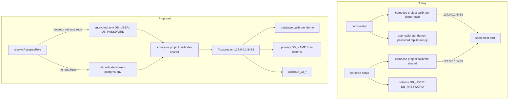

# Join demo-setup onto calibrate-shared Postgres

## Verdict

Yes, the two paths can share one Docker Postgres. They already share the important physical resources: [compose.yaml](compose.yaml), `postgres:18`, and `127.0.0.1:5433`.

They cannot share that cluster until they also share the **role that was baked into the volume on first `docker compose up`**. `POSTGRES_USER` / `POSTGRES_PASSWORD` are applied only when the volume is empty. After that, every client has to use those credentials.

The current demo “isolation” is weaker than it looks. [`getDemoDockerProjectName()`](packages/local-runtime-config/src/demo-catalog-setup.ts) hashes the checkout into `calibrate-demo-<hash>`, but the published port is still `5433`. Two compose projects cannot actually run at once. Worktree setup is the honest model: one project, one port, many databases.

Do **not** join E2E into this. [`apps/web-e2e/e2e-runtime.ts`](apps/web-e2e/e2e-runtime.ts) uses Testcontainers on ephemeral ports and should stay that way.



## Security: do not commit DB_PASSWORD

Do not pin a loopback password in [compose.yaml](compose.yaml) or any committed file. For a public repo that is the wrong trade:

- GitHub secret scanning and a hiring-manager skim will treat a committed `DB_PASSWORD` as a real secret, even if Compose publishes only `127.0.0.1:5433`.
- Loopback is the current bind, not a forever invariant. If someone later maps `5433:5432` without the `127.0.0.1` prefix, a public password becomes a LAN-reachable login.
- Encrypted `.env` values in git are not usable by evaluators without gitignored `.env.keys`. That encryption is the right store **for you**; it is not an evaluator setup path.

Also reject `POSTGRES_HOST_AUTH_METHOD=trust` in the public compose file.

`POSTGRES_DB=postgres` as a bootstrap database name is not a credential and can stay in compose.

## Credential precedence

“Exists” means `dotenvx get DB_USER` and `dotenvx get DB_PASSWORD` succeed (private key present via `.env.keys` or `DOTENV_PRIVATE_KEY`, values non-empty). Encrypted assignments in committed `.env` do not count; every clone has those bytes.

`resolvePostgresRole()`:

1. If dotenvx can decrypt `DB_USER` and `DB_PASSWORD`, use those. Do **not** copy them into `~/.calibrate/shared-postgres.env`. That would duplicate the secret in plaintext and undo encrypted-at-rest storage for local/production-like runs.
2. Otherwise read or generate `~/.calibrate/shared-postgres.env` (password from `crypto.randomBytes`; username may be a fixed local name such as `calibrate`).

Worktree setup, worktree teardown, printed `backend:dev` commands, **and** demo-setup’s Postgres connection all use this resolver. Demo-setup cannot skip step 1 on a developer machine: if the volume was initialized with dotenvx credentials, a machine-local fallback would fail to connect. Using the resolver is not “demo requires `.env.keys`”; it is “use keys when they are already there.”

ADR-0004 stays: demo must not require Dotenvx, and demo runtime still must not decrypt JWT/HMAC/email/FDC from `.env`. Decrypting only `DB_USER` / `DB_PASSWORD` during setup, when the key is already present, is the developer-machine join.

## Why dotenvx is currently a hard wall for evaluators

[worktree-setup.ts](workspace/src/worktree-setup.ts) starts Postgres with `dotenvx run` and [env-keys.ts](workspace/src/env-keys.ts) throws if `.env.keys` is missing. That blocks an evaluator from sampling worktrees even after machine-local Postgres exists.

[`formatBackendDevCommand()`](workspace/src/print-dev-commands.ts) already prefers dotenvx for `DB_USER` / `DB_PASSWORD` (it only overrides host/port/name). Keep that when the key exists. When it does not, `dotenvx run --overload` cannot start `backend:dev` anyway because JWT material is also encrypted.

## Recommended join

**Container**

- Keep `COMPOSE_PROJECT_NAME=calibrate-shared`.
- Start Postgres only when `127.0.0.1:5433` is closed (already in [postgres-health.ts](workspace/src/postgres-health.ts)).
- Inject the resolved role into the `docker compose` child environment so it overrides encrypted project `.env` interpolation. Keep `${DB_USER}` / `${DB_PASSWORD}` in [compose.yaml](compose.yaml); no literals.
- Set `POSTGRES_DB` to `postgres` (bootstrap/healthcheck only).

**Consumers create databases, they do not own the cluster**

- Demo: `CREATE DATABASE calibrate_demo` if missing, then migrate + seed. Stop using `otpHmacKey` as the DB password.
- Primary worktree with dotenvx: still uses dotenvx `DB_NAME`.
- Linked worktrees: still `calibrate_wt_<slug>_<hash>`.
- Any worktree **without** decryptable `DB_NAME`: derive `calibrate_wt_<slug>_<hash>` even on the main checkout, so evaluators get per-worktree databases without reading `.env`.
- Demo runtime ([demo-runtime.ts](apps/backend/src/infrastructure/demo-runtime.ts)) uses the resolved role, not `otpHmacKey`. `.local.env` stays for JWT/HMAC only.

**Worktree setup / teardown without keys**

- Stop treating [`ensureEnvKeys()`](workspace/src/env-keys.ts) as a hard precondition for Postgres provisioning. Copy keys from the primary checkout when present; if absent, continue with the machine-local role.
- Teardown still refuses `postgres`, `template*`, and `calibrate_demo`. If dotenvx `DB_NAME` is available, also refuse that primary database. If it is not, only allow dropping this worktree’s `calibrate_wt_*` name.

**Printed commands**

- Dotenvx available: keep today’s `npx dotenvx run --overload ... -- npx nx run backend:dev` so the process decrypts `DB_USER` / `DB_PASSWORD` (and the rest of local/prod-like config) at start. That is the path for running a production-like environment locally later.
- Dotenvx absent: do not print `dotenvx run`. Print worktree host/port/DB_NAME plus machine-local `DB_USER` / `DB_PASSWORD` and the demo runtime entrypoint (`CALIBRATE_DEMO=1` / generated `.local.env`). An evaluator cannot run non-demo `backend:dev` without JWT keys; worktree sampling for them is shared Postgres, sticky ports, and per-worktree databases under demo mode.

**Reset must shrink, not grow**

ADR-0004 already says demo-reset recreates **only** demo database state. Today it runs `docker compose ... down --volumes`, which would destroy every worktree database if the project were shared. Reset should `DROP DATABASE calibrate_demo` / recreate / reseed, matching [worktree-teardown.ts](workspace/src/worktree-teardown.ts).

**Existing volumes**

A volume already initialized with dotenvx credentials keeps working for you: resolver step 1 matches it. An evaluator laptop generates a new machine-local role and a new volume. If a machine has an old volume and only the other kind of credentials, document `docker compose -p calibrate-shared down --volumes` as the explicit recreate. Tear down any leftover `calibrate-demo-*` project on `5433` once.

## What not to do

- Do not commit `DB_PASSWORD` to GitHub.
- Do not require `.env.keys` for demo-setup or for evaluator worktree Postgres provisioning.
- Do not copy dotenvx `DB_PASSWORD` into `~/.calibrate/shared-postgres.env`.
- Do not keep a hashed `calibrate-demo-*` project “just in case.”
- Do not let demo write `otpHmacKey` as the cluster password.
- Do not enable `POSTGRES_HOST_AUTH_METHOD=trust` in the public compose file.
- Do not change E2E Testcontainers.

## Code seams

Shared helper: `resolvePostgresRole()` then “if port closed, `docker compose -p calibrate-shared up postgres` with that role; wait until `SELECT 1` works; `CREATE DATABASE` if missing.”

Natural home is [packages/local-runtime-config](packages/local-runtime-config) (already owns demo Docker) with [workspace/src/worktree-setup.ts](workspace/src/worktree-setup.ts) importing it. `CREATE DATABASE` currently uses `pg` from [apps/backend/package.json](apps/backend/package.json). Extracting it into `local-runtime-config` either adds a `pg` dependency (needs confirmation) or uses `docker compose exec ... psql`. Prefer keeping one SQL approach.

Touch list:

- [compose.yaml](compose.yaml) — interpolate `${DB_USER}` / `${DB_PASSWORD}` from process env; bootstrap `POSTGRES_DB=postgres`
- New helper under [packages/local-runtime-config](packages/local-runtime-config) — dotenvx-first resolver + machine-local fallback file
- [packages/local-runtime-config/src/demo-catalog-setup.ts](packages/local-runtime-config/src/demo-catalog-setup.ts) — shared project, skip-if-up, create `calibrate_demo`, same resolver
- [workspace/src/worktree-setup.ts](workspace/src/worktree-setup.ts) / [worktree-teardown.ts](workspace/src/worktree-teardown.ts) / [env-keys.ts](workspace/src/env-keys.ts) / [print-dev-commands.ts](workspace/src/print-dev-commands.ts) — dotenvx-first role; keys optional for evaluator worktrees; printed commands branch on whether dotenvx is usable
- Fast suite test colocated with the role resolver — relocate/restore repo `.env.keys` and prove the machine-local fallback
- [apps/backend/src/infrastructure/demo-runtime.ts](apps/backend/src/infrastructure/demo-runtime.ts) — `DB_USER`/`DB_PASSWORD` from the resolved role
- [README.md](README.md) and [docs/adr/0004-self-contained-local-demo-mode.md](docs/adr/0004-self-contained-local-demo-mode.md) — one cluster; dotenvx preferred when present; machine-local fallback; demo still does not require Dotenvx

## No-keys fallback test

Add an automated test that proves the machine-local role path when this checkout has no dotenvx private key. Use Node `fs/promises` (`rename`, not a shell `mv`) to move the repo `.env.keys` aside for the duration of the test, then move it back.

Shape:

```ts
const envKeysPath = path.join(workspaceRoot, ".env.keys");
const asidePath = path.join(os.tmpdir(), `calibrate-env-keys-${randomUUID()}`);

try {
  await rename(envKeysPath, asidePath);
  delete process.env.DOTENV_PRIVATE_KEY;
  // assert resolvePostgresRole() uses the injected machine-local file,
  // and worktree setup no longer throws from ensureEnvKeys
} finally {
  await rename(asidePath, envKeysPath).catch(() => undefined);
  // restore DOTENV_PRIVATE_KEY if the test process had one
}
```

Required safety, because this mutates a gitignored secret file in the real checkout:

- Restore in `finally`, not only on the happy path. `afterEach` is not enough if the process is killed mid-test; `finally` is the minimum. Pair it with `afterEach` as a second restore attempt.
- Also delete `process.env.DOTENV_PRIVATE_KEY` for the test body (same pattern as [workspace/src/env-keys.test.ts](workspace/src/env-keys.test.ts)). Relocating the file is not enough if the key is in the environment.
- Point the machine-local role file at a temp path injected into the helper. Do not write the real `~/.calibrate/shared-postgres.env` during this test.
- If `.env.keys` is already absent (CI, evaluator clone), skip the rename and still run the fallback assertions. The relocate step is how this repo with keys simulates that clone; CI is already in that state.
- After restore, assert `.env.keys` is back at the original path when the test started with it present.

This belongs in the fast suite (`*.test.ts`), not Docker/integration, because it is testing credential _selection_, not Compose.

## Feasibility caveats

This join reduces paths for **persistent local Docker Postgres**. It does not make hiring-manager setup and developer worktree setup the same command: evaluators still generate `.local.env` and seed `calibrate_demo`; you still use dotenvx for app secrets and for a production-like `backend:dev`. The shared part is “resolve the cluster role, ensure `calibrate-shared`, create/migrate this database.”
